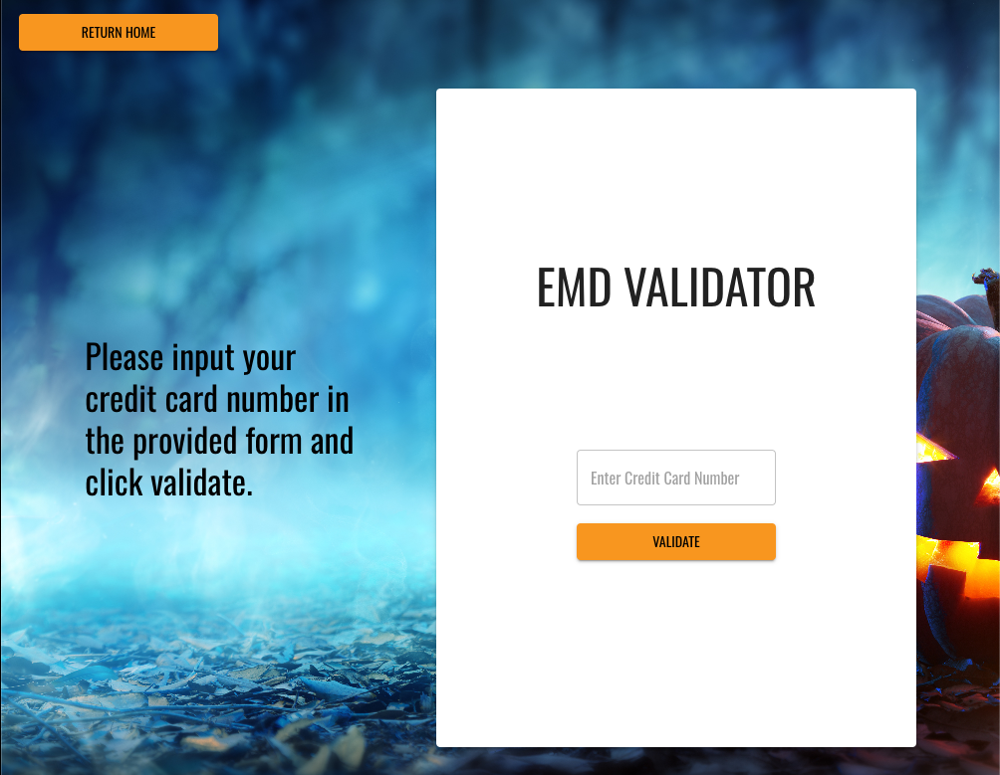
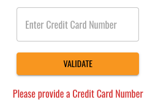
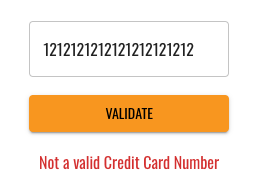
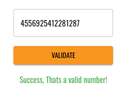

# EMD-Validator
This is a small React Typescript application and Express Node.js server for validating credit card numbers with a Luhn algorithm.
| Home | Validator |
| ---- | --------- |
|  | 
---
## Requirements:

### Credit Card Validator

#### Objectives:
- This take home assignment will allow us to have a more in depth
conversation in your follow up interview
- Technical Requirements:
    - Use React, node.js and typescript for your application
    - Authentication and DB are not needed
- Functional Requirements:
    - The main purpose of this application is to create a webpage to validate a
Credit Card number
    - Use the Luhn checksum algorithm for validation
    - Validation should happen in the back-end (API) not the frontend
- Minimal UI Requirements:
    - At least one text box should be included for credit card input
    - Screen should display if the number is valid or not

    
---

## Running this app Locally
You will need to run two separate terminals. One for the server an one for the client.
- Assuming you have this code locally, open a terminal to the main directory.  
- FOR THE CLIENT: 
    - You will navigate into the "client" directory from the root of the project and run the following commands. 
        - First make sure you load all dependencies with `yarn`
        - Then to start the client run `yarn start`
- FOR THE SERVER:
    - You will navigate into the "server" directory from the root of the project and run the following commands. 
        - First make sure you load all dependencies with `yarn`
        - Then to start the server run `yarn serve`

- Once you get them running you are free to check the validator. 
---
### Testing the Validation: 
- There are three cases to test here.
1. You have not entered a number at all in to the validation form.
    - For this you will click on the main page to be taken to the validator. 
    - With an empty textfield you will click on the validate button. 
    - You should see the error message "Please provide a Credit Card Number" 
    
2. You have entered an invalid credit card number. 
    - For this enter any random number like `121212121212121212` into the form.
    - Click the validate button to submit.
    - You should see the error message "Not a valid Credit Card Number" 
    
3. You have entered a valid credit card number. 
    - For this case enter a valid number like `4556925412281287` into the form.
    - Click the validate button to submit. 
    - You should see the success message "Success, Thats a valid number!"
    
---
### Testing Continued
---
Both the App and the Server have test written with there perspective scripts added to the `package.json`.
- To run tests on the validation logic in the server: 
    - In a console of your choice navigate to `server` from the root directory of this project. 
    - Run the command `yarn test`
- To run tests on the display of the error messages in the App:
    - In the console of you choice navigate to `client` from the root directory of this project.
    - Run the command `yarn test`